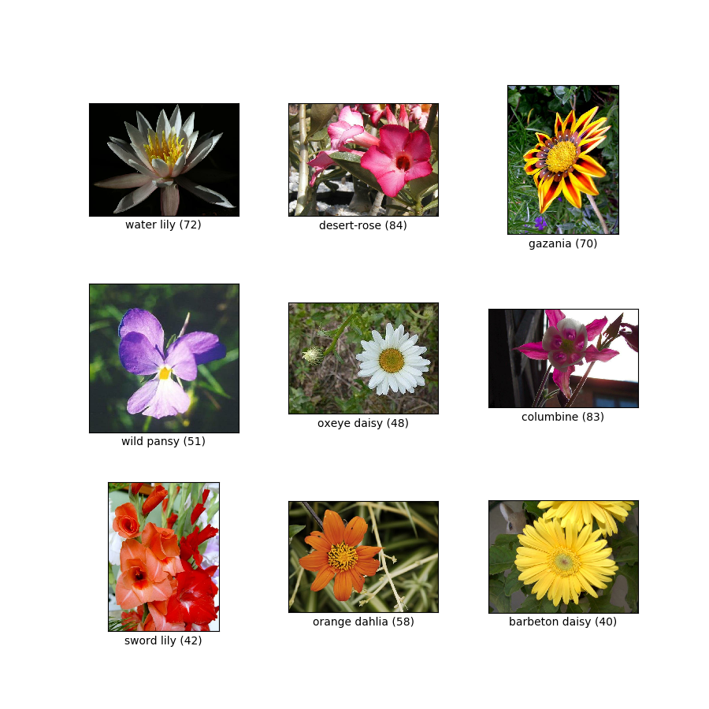
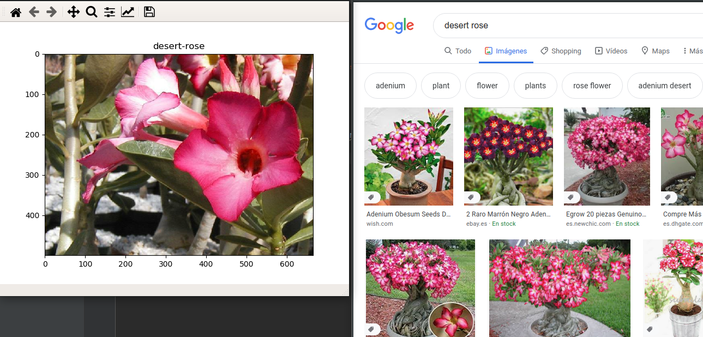
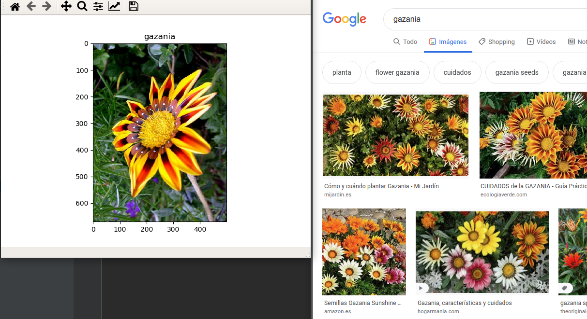
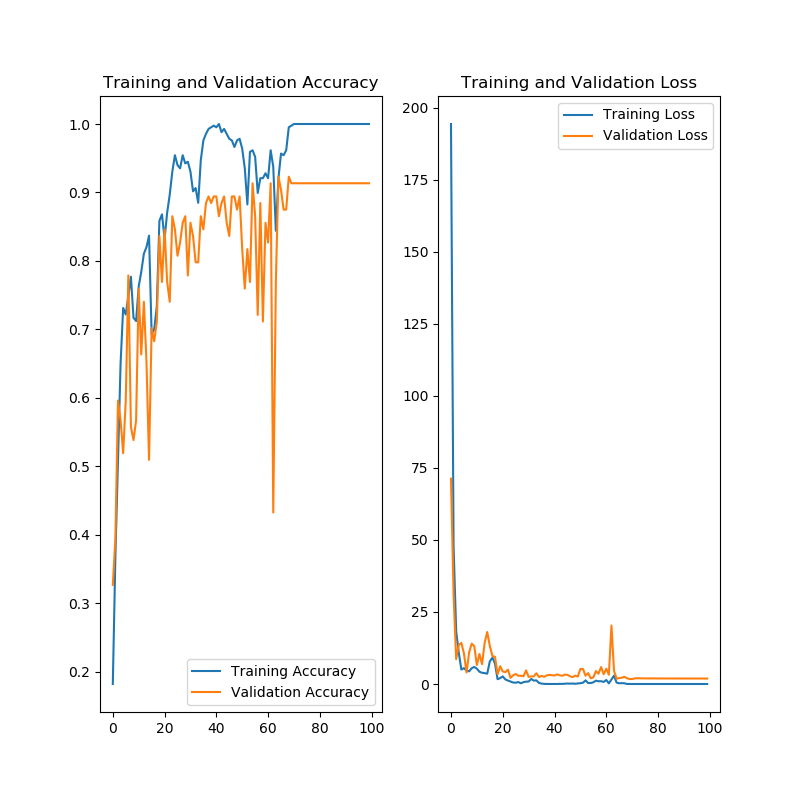
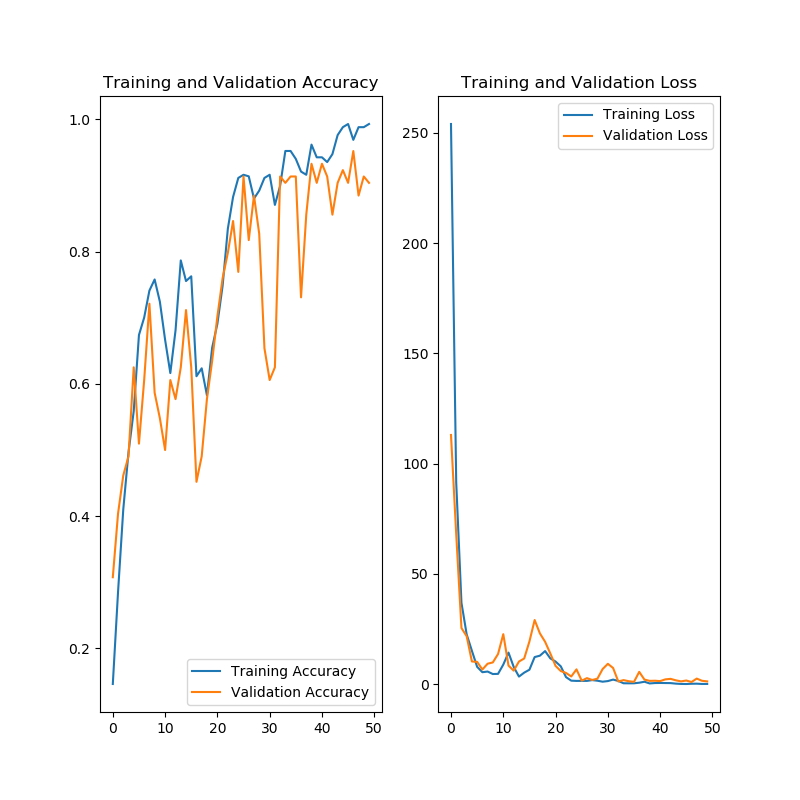
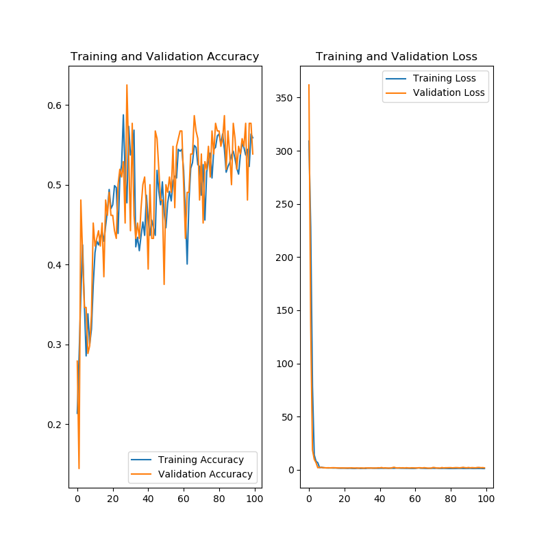
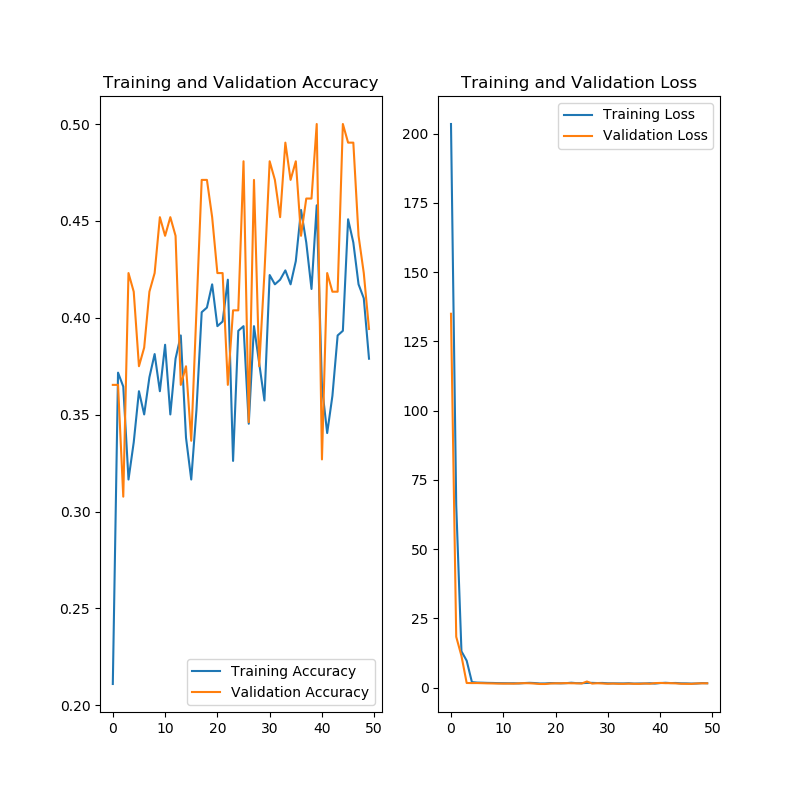
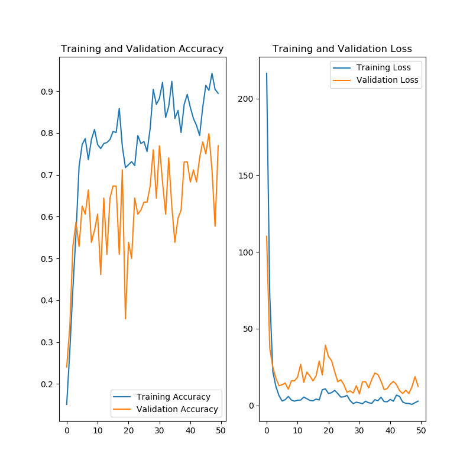
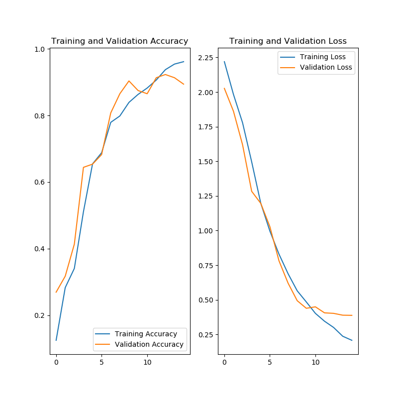

# Clasificación de flores

Dentro de los posibles dataset que existen en internet hay uno de 102 clases con imágenes de flores. La información está en este [enlace](http://www.robots.ox.ac.uk/~vgg/data/flowers/102/index.html).

Estos datos se usaron para realizar la investigación: "Automated flower classification over a large number of classes".  [Enlace al paper](http://www.robots.ox.ac.uk/~vgg/publications/2008/Nilsback08/nilsback08.pdf)

Estos dataset de pruebas y formación suelen estar incluidos en alguna librería. A Día de hoy (04/06/2020) está contenido en ```tfds-nightly```.


## Cargando dataset tensorflow

Cargamos el dataset (todos los datos) y la información de los datos

```python

import tensorflow_datasets as tfds

# La primera vez descargará los datos
labeled_ds, summary = tfds.load('oxford_flowers102', split='train+test+validation', with_info=True)

```

La información es la siguiente

```python

tfds.core.DatasetInfo(
    name='oxford_flowers102',
    version=2.1.1,
    description='The Oxford Flowers 102 dataset is a consistent of 102 flower categories commonly occurring
in the United Kingdom. Each class consists of between 40 and 258 images. The images have
large scale, pose and light variations. In addition, there are categories that have large
variations within the category and several very similar categories.

The dataset is divided into a training set, a validation set and a test set.
The training set and validation set each consist of 10 images per class (totalling 1020 images each).
The test set consists of the remaining 6149 images (minimum 20 per class).',
    homepage='https://www.robots.ox.ac.uk/~vgg/data/flowers/102/',
    features=FeaturesDict({
        'file_name': Text(shape=(), dtype=tf.string),
        'image': Image(shape=(None, None, 3), dtype=tf.uint8),
        'label': ClassLabel(shape=(), dtype=tf.int64, num_classes=102),
    }),
    total_num_examples=8189,
    splits={
        'test': 6149,
        'train': 1020,
        'validation': 1020,
    },
    supervised_keys=('image', 'label'),
    citation="""@InProceedings{Nilsback08,
       author = "Nilsback, M-E. and Zisserman, A.",
       title = "Automated Flower Classification over a Large Number of Classes",
       booktitle = "Proceedings of the Indian Conference on Computer Vision, Graphics and Image Processing",
       year = "2008",
       month = "Dec"
    }""",
    redistribution_info=,
)
```

De entre la información podemos destacar:
- Número de datos: 8189 (test:6149, train: 1020, validation: 1020)
- Forma de supervisión: imágenes - etiqueta

Si nos vamos a la raíz de nuestro usuario vemos que se ha creado una carpeta ```tensorflow_datasets```... ¿Podremos ver la imágenes? La librería dstf (dataset, tensorflow) implementa la visualización de los datos si le pasamos el dataset y su información

```python
fig = tfds.show_examples(labeled_ds, summary)
``` 




## Jugando con los Dataset

Vamos a obtener varios elementos, pintar y consultar la información de su etiqueta. Volvemos a traer los datos con el campo ```as_supervised``` a True. De esta forma veremos cómo estarán las fotos y los datos para la supervisión. 

Los datos supervisados vienen en forma de array numérico representando la imagen y un valor numérico representando la clase. El siguiente código muestra una imágen con su etiqueta

```python

import tensorflow as tf
import tensorflow_datasets as tfds
import numpy as np
from matplotlib import pyplot as plt

labeled_ds, summary = tfds.load('oxford_flowers102', split='train+test+validation', with_info=True, as_supervised=True)

e=next(iter(labeled_ds.shuffle(4)))

array_image = e[0]
value_label = e[1]
label = tfds.image_classification.oxford_flowers102._NAMES[value_label]


plt.imshow(array_image, interpolation='nearest')
plt.title(label)
plt.show()
```

Haciendo un par de ejecuciones y comprobando los resultados con google parace que controlamos los datos.




El script con el código es: ```view_image.py```

## Preparando los datos

Si vemos la imágenes cada una de ellas tienen un tamaño y necesitamos tener las imagenes con un tamaño similar para conectarlo a la red neuronal. Aprovechamos este preprocesamiento para hacer que cada valor de los píxeles esté comprendido entre 0 y 1, por último hacemos que la imagen representada por una array bidimensional se transforme en un array de 1 dimensión.

Resumen:
- Cambiar tamaño imagen ```ts.resize```
- Pasar RGB 255 a RGB 1-0 ```divisón entre 255.0```
- Aplanar el array ```ts.reshape```

El código de la función para hacer esto sería el siguiente:
```python
IMAGE_RES = 300

def format_image(image, label):
  image = tf.image.resize(image, (IMAGE_RES, IMAGE_RES))/255.0
  return tf.reshape(image, [-1]), label
```

Ahora podemos coger la función map de los dataset para aplicarla a todo el conjunto de datos.

```python
dataset = dataset.map(format_image)
```

Este conjunto de datos y la división de entrenamiento, validación y test está preparado para el modelo diseñado en el paper. En nuestras pruebas no haremos uso de esa separación.

```python
tall = tfds.load('oxford_flowers102', split='test+train+validation', as_supervised=True)
```

En este conjunto de datos tenemos 102 clases, quizá son demsiadas para las primeras pruebas. Vamos a usar la función de filtrado de los dataset para solo coger etiquetas de las 10 primeras clases.

```python
#Cogemos solo flores de las primeras 10 clases
dataset = dataset.filter(lambda i,l: l < 10)
```

```python
#Información de los datos
num_training_examples = 1020
num_validation_examples = 6149
num_test_examples = 1020

num_all = num_training_examples+num_validation_examples+num_test_examples

tall = tall.shuffle(num_all)
tall = tall.filter(lambda i,l: l < 10)

item_count = 0

for i in tall:
    item_count=item_count+1

ntrain = int(0.8 * item_count)
nval = int(0.2 * item_count)

print('Total: {}'.format(item_count))
print('Train: {}'.format(ntrain))
print('Val: {}'.format(nval))
```

Los datos para esta prueba son:
- Total: 522 
- Train: 417 
- Val: 104 

Para obtener los 2 dataset (train y validation) con estas imágenes/etiquetas ejecutamos la división sobre el dataset filtrado. También configuramos el tamaño del batch y la precarga de un elemento. 

```python
IMAGE_RES = 400
BATCH_SIZE = 32

def format_image(image, label):
  image = tf.image.resize(image, (IMAGE_RES, IMAGE_RES))/255.0
  return tf.reshape(image, [-1]), label

train_batches = tall.take(ntrain).cache().map(format_image).batch(BATCH_SIZE).prefetch(1)
validation_batches = tall.skip(ntrain)
validation_batches = validation_batches.take(nval).cache().map(format_image).batch(BATCH_SIZE).prefetch(1)
```


## Red densa

Vamos a coger una resolución pequeña y configurar una red de la siguiente forma:
- Entrada: dimensión del array
- Oculta 1: 200
- Salida: 10
- EPOCH: 100
- Resolución: 400

Compilación:
```python
Model: "sequential"
_________________________________________________________________
Layer (type)                 Output Shape              Param #   
=================================================================
dense (Dense)                (None, 200)               96000200  
_________________________________________________________________
dense_1 (Dense)              (None, 10)                2010      
=================================================================
Total params: 96,002,210
Trainable params: 96,002,210
Non-trainable params: 0
_________________________________________________________________
```

Si hacemos una clasificación aleatoria al tener 10 clases acertamos un 10% de las veces. Los resultados y la evolución de nuestra red neuronal es:




Se ha entrenado el modelo 3 veces con resultados distintos. El acierto está cerca del 90% aunque la red tiene algo de sobreajuste.

En otra ejecución el acierto ha sido menor 55%


## Red densa 2

Para reducir el sobre ajuste vamos a poner 170 neuronas en la capa oculta.

El modelo es el siguiente:
```python
Model: "sequential"
_________________________________________________________________
Layer (type)                 Output Shape              Param #   
=================================================================
dense (Dense)                (None, 170)               81600170  
_________________________________________________________________
dense_1 (Dense)              (None, 10)                1710      
=================================================================
Total params: 81,601,880
Trainable params: 81,601,880
Non-trainable params: 0
```



En los resultados anteriores se puede ver que los datos de entrenamiento y los de validación van a la par aunque no se estabilizan.



En esta segunda ejecución sigue apareciendo el sobre ajuste.

### código completo

El código de estas pruebas está:
- ```reddensa10_200.py```
- ```reddensa10_170.py```


## Red convolucional

Para meter esta información en una red convolucional hay un ajuste que no es necesario hacer. En los ejemplos anteriores transformamos el array 2D de la imagen en un array de 1D, en este caso lo vamos a poner a la capa convolucional 2D, por tanto en la función de redimensión quitarmos el ```reshape```

```python
IMAGE_RES = 300

def format_image(image, label):
  image = tf.image.resize(image, (IMAGE_RES, IMAGE_RES))/255.0
  #return tf.reshape(image, [-1]), label   ##No hay reshape
  return image, label
```

El modelo para esta prueba tiene 2 etapas convolucionales con la reducción (doble), aplanamiento y parte densa.

```python
# Modelo
model = Sequential()
# padding -> valid -> sin padding
# 32 filtros
model.add(Conv2D(4, (3, 3), input_shape=(IMAGE_RES, IMAGE_RES, 3), padding="valid", activation="relu"))
model.add(MaxPooling2D(pool_size=(2, 2)))
model.add(MaxPooling2D(pool_size=(2, 2)))
model.add(Conv2D(8, (3, 3), padding="valid", activation="relu"))
model.add(MaxPooling2D(pool_size=(2, 2)))
model.add(MaxPooling2D(pool_size=(2, 2)))
model.add(Flatten())
model.add(Dense(20, activation="relu"))
model.add(Dense(10, activation='softmax'))
```

El modelo es:

```python
_________________________________________________________________
Layer (type)                 Output Shape              Param #   
=================================================================
conv2d (Conv2D)              (None, 398, 398, 4)       112       
_________________________________________________________________
max_pooling2d (MaxPooling2D) (None, 199, 199, 4)       0         
_________________________________________________________________
max_pooling2d_1 (MaxPooling2 (None, 99, 99, 4)         0         
_________________________________________________________________
conv2d_1 (Conv2D)            (None, 97, 97, 8)         296       
_________________________________________________________________
max_pooling2d_2 (MaxPooling2 (None, 48, 48, 8)         0         
_________________________________________________________________
max_pooling2d_3 (MaxPooling2 (None, 24, 24, 8)         0         
_________________________________________________________________
flatten (Flatten)            (None, 4608)              0         
_________________________________________________________________
dense (Dense)                (None, 20)                92180     
_________________________________________________________________
dense_1 (Dense)              (None, 10)                210       
=================================================================
Total params: 92,798
Trainable params: 92,798
Non-trainable params: 0

```

Se han realizado distintas ejecuciones y distintos ajustes, en todos ellos con una complejidad menor a cuanto al número de pesos se obtienen resultados mucho mejores.

El resultado de esta red es:



## Conclusiones-dudas

### Dudas
- Hay una gran diferencia entre ejecuciones... supongo que será por el estado inicial aleatorio. ¿Es así?
- Si el conjunto de entrenamiento y el de validación tienen datos reales ¿Por qué decimos que no generaliza si la validación no está por encima?
    - Tendría sentido si la validación es de datos reales y el entrenamiento otro tipo de datos.

### Relación de pesos
La redes convolucionales hacen mejor clasificación con imágenes con una complejidad mucho menor.
CNN ->     92,798
DNN -> 81,601,880


## Otras pruebas

Jugar con las 103 clases.