# Análisis de los filtros de la red

¿Cómo ve nuestra red neuronal las imágenes con los filtros aprendidos?

## Un perro a lo largo de la red

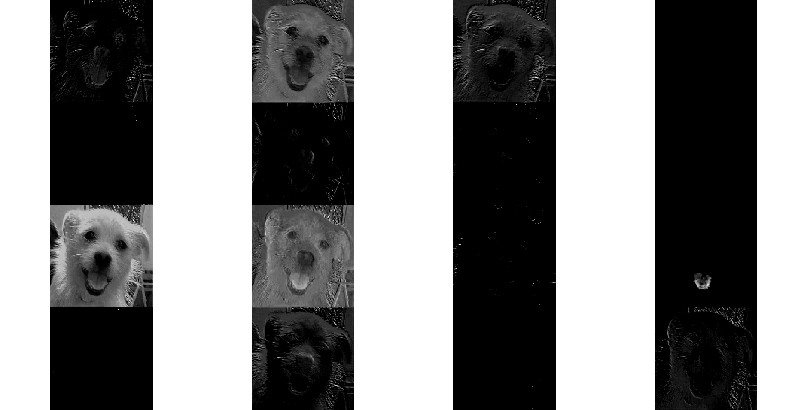
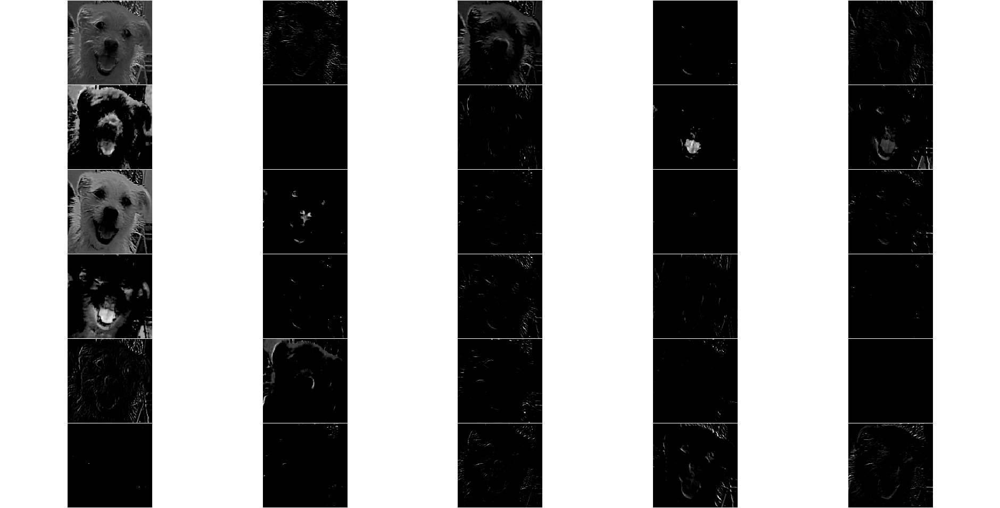
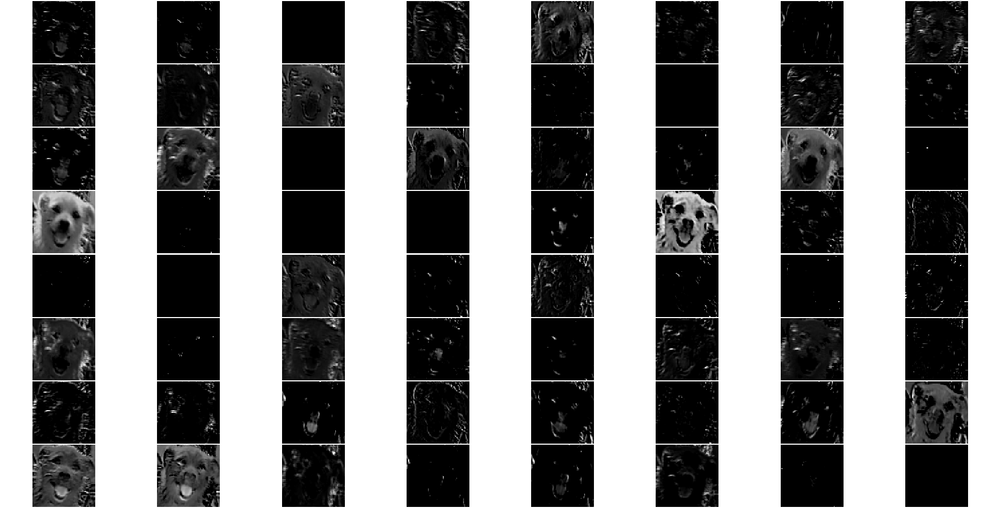
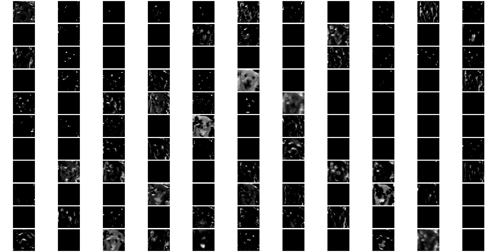
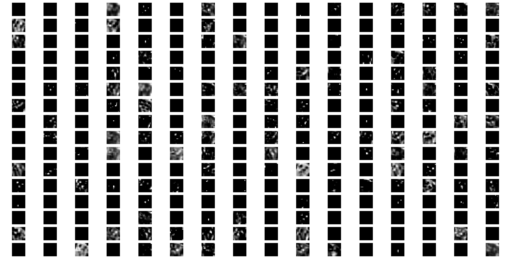
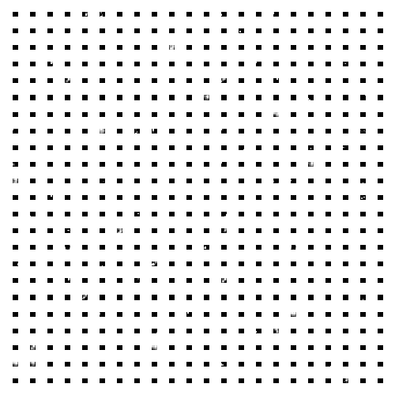

## Distintas imágenes en la misma capa

Sin procesar

Primer filtro

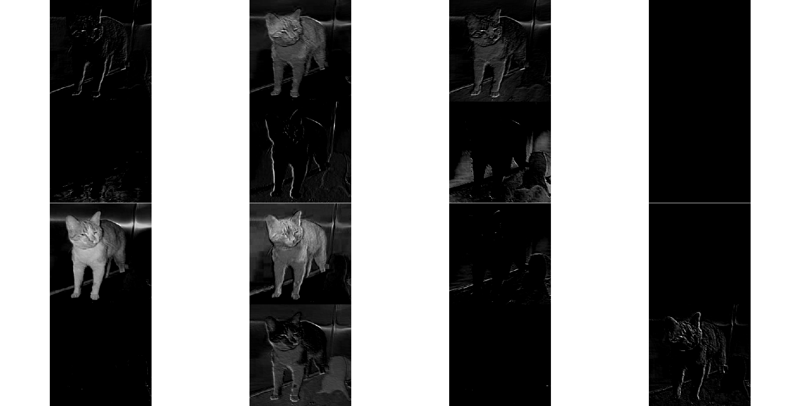

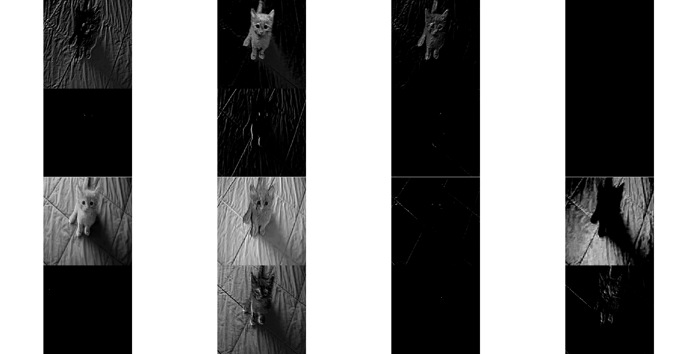

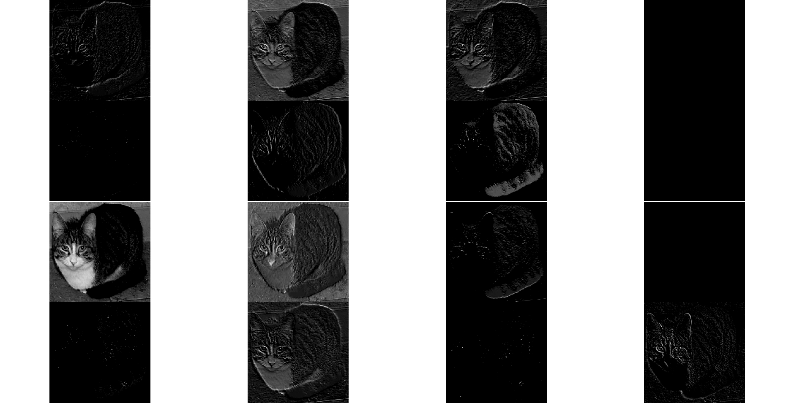

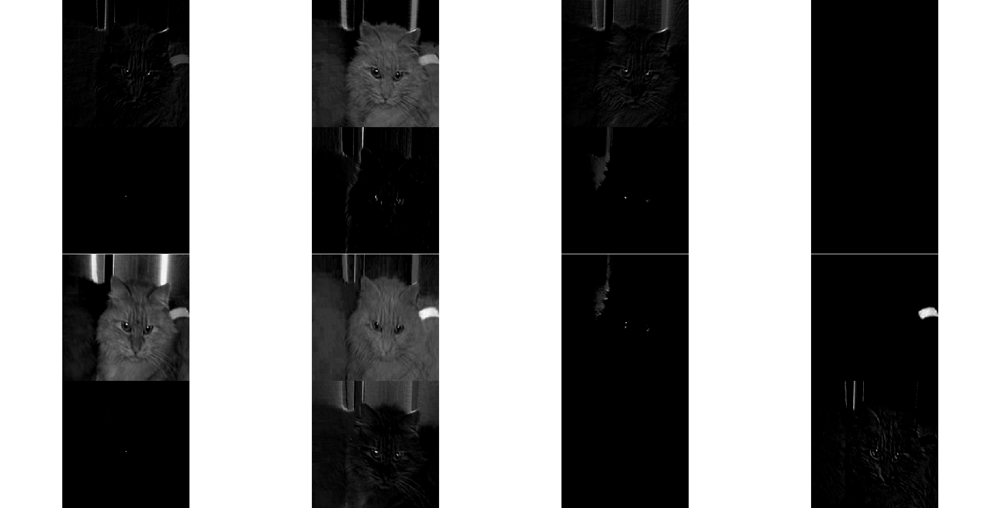

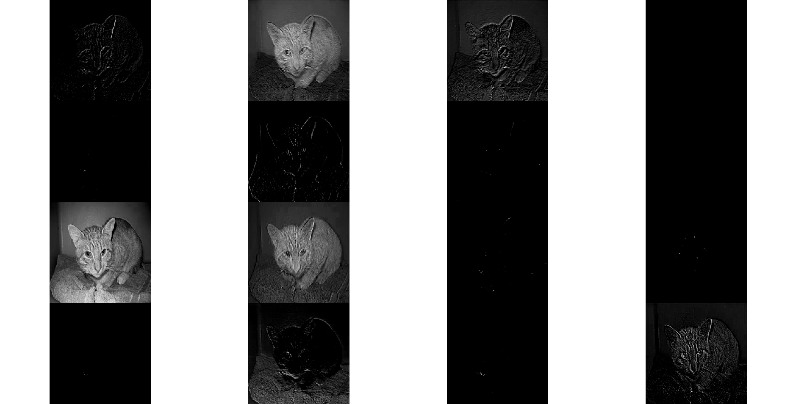

Cuarto filtro

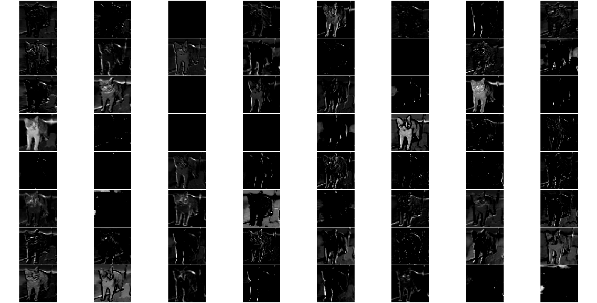

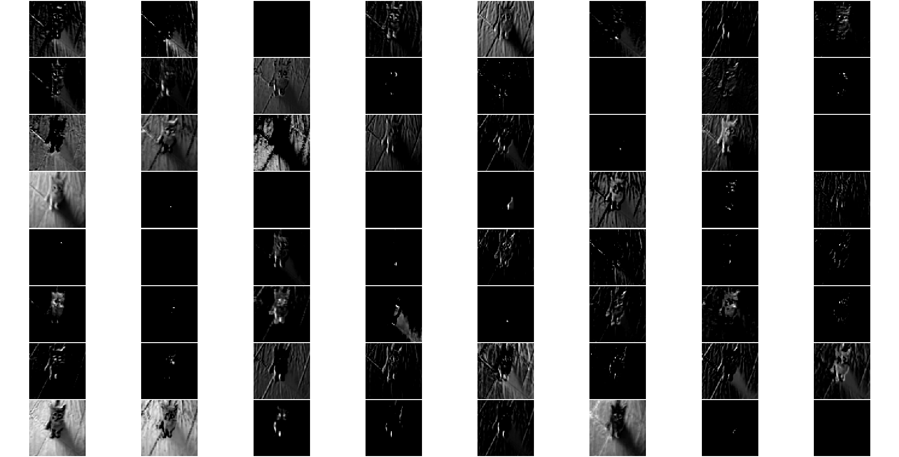

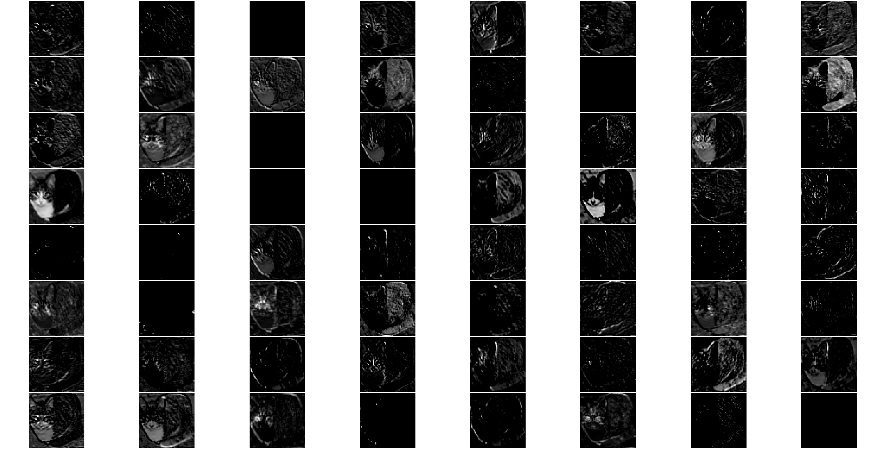

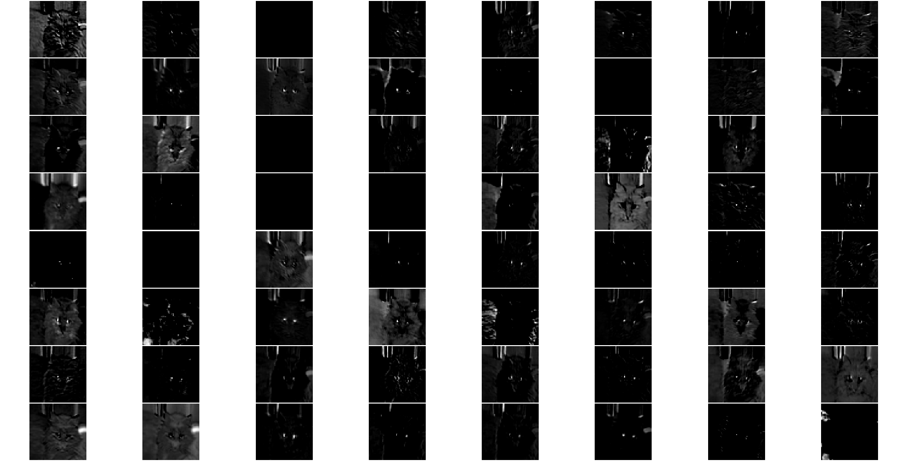

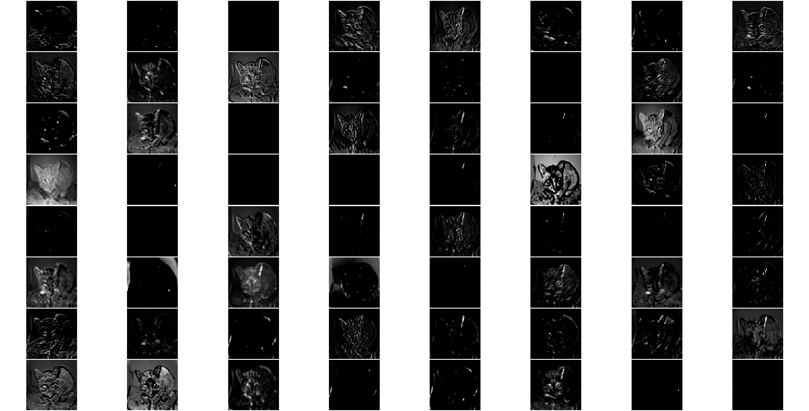