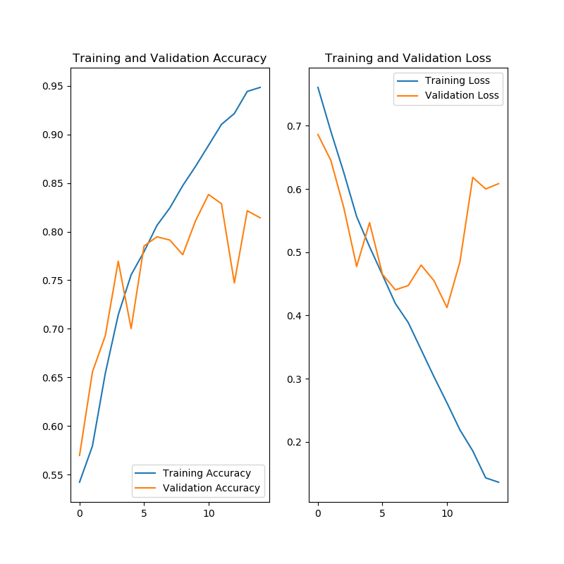
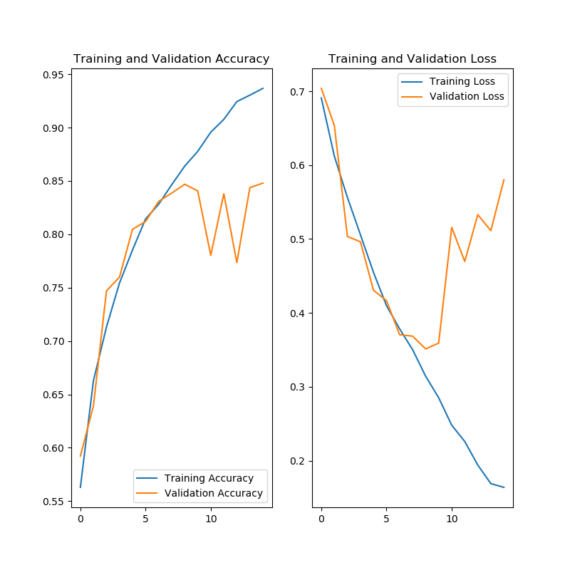
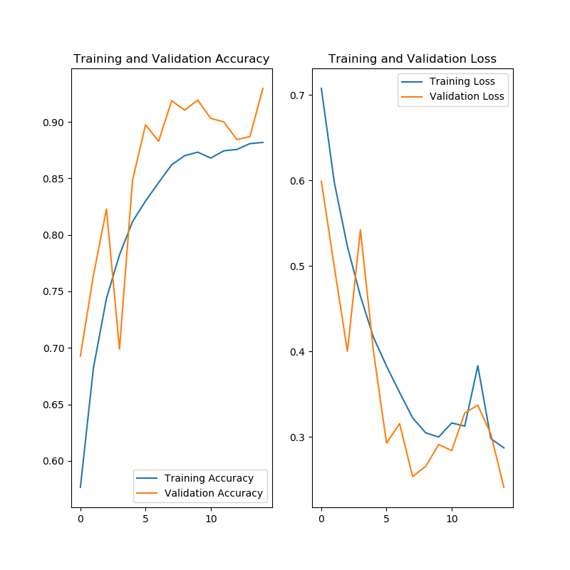

# Mi propia red

Aquí vamos a jugar con una red diseñada para esta tarea y haremos distintas pruebas

## Modelo

Tras varias pruebas en las que la exactitud no mejoraba a la media y modificando el modelo y los hiperparámetros se ha conseguido un modelo que tiene una buena predicción aunque tiene overfiting

```python
model.add(Conv2D(32, (3, 3), input_shape=(IMAGE_RES, IMAGE_RES, 3), padding="valid", activation="relu"))
model.add(MaxPooling2D(pool_size=(2, 2)))
model.add(Conv2D(64, (3, 3), padding="valid", activation="relu"))
model.add(MaxPooling2D(pool_size=(2, 2)))
model.add(Conv2D(128, (3, 3), padding="valid", activation="relu"))
model.add(MaxPooling2D(pool_size=(2, 2)))
model.add(Conv2D(256, (3, 3), padding="valid", activation="relu"))
model.add(MaxPooling2D(pool_size=(2, 2)))
model.add(Flatten())
model.add(Dense(400, activation="relu"))
model.add(Dense(100, activation="relu"))
model.add(Dense(1, activation='sigmoid'))
```

Los parámetros a aprender son:

```python
_________________________________________________________________
Layer (type)                 Output Shape              Param #   
=================================================================
conv2d (Conv2D)              (None, 198, 198, 32)      896       
_________________________________________________________________
max_pooling2d (MaxPooling2D) (None, 99, 99, 32)        0         
_________________________________________________________________
conv2d_1 (Conv2D)            (None, 97, 97, 64)        18496     
_________________________________________________________________
max_pooling2d_1 (MaxPooling2 (None, 48, 48, 64)        0         
_________________________________________________________________
conv2d_2 (Conv2D)            (None, 46, 46, 128)       73856     
_________________________________________________________________
max_pooling2d_2 (MaxPooling2 (None, 23, 23, 128)       0         
_________________________________________________________________
conv2d_3 (Conv2D)            (None, 21, 21, 256)       295168    
_________________________________________________________________
max_pooling2d_3 (MaxPooling2 (None, 10, 10, 256)       0         
_________________________________________________________________
flatten (Flatten)            (None, 25600)             0         
_________________________________________________________________
dense (Dense)                (None, 400)               10240400  
_________________________________________________________________
dense_1 (Dense)              (None, 100)               40100     
_________________________________________________________________
dense_2 (Dense)              (None, 1)                 101       
=================================================================
Total params: 10,669,017
Trainable params: 10,669,017
Non-trainable params: 0
```

Resultados:


Hemos llegado a cerca de un 85% de exactitud. Hay que tener en cuenta que el dataset de fotos es difícil. Vamos a ver si en el siguiente modelo conseguimos aumentar la exactitud y reducir el overfiting.

## Nuevo modelo

Vamos a realizar los siguientes cambios:
- Aumentar la resulución de las imágenes a 300px
- Aumentar las capas de la red para mejorar la exactitud
- Reducir las capas densas y meter lagunos drops para reducir el overfiting
- Reducir el tamaño de del batch para evitar los saltos en la red.

```python
IMAGE_RES=300
EPOCHS=15
BATCH=128

#...

model.add(Conv2D(16, (3, 3), input_shape=(IMAGE_RES, IMAGE_RES, 3), padding="valid", activation="relu"))
model.add(MaxPooling2D(pool_size=(2, 2)))
model.add(Conv2D(32, (3, 3), padding="valid", activation="relu"))
model.add(MaxPooling2D(pool_size=(2, 2)))
model.add(Dropout(0.1))
model.add(Conv2D(64, (3, 3), padding="valid", activation="relu"))
model.add(MaxPooling2D(pool_size=(2, 2)))
model.add(Dropout(0.1))
model.add(Conv2D(128, (3, 3), padding="valid", activation="relu"))
model.add(MaxPooling2D(pool_size=(2, 2)))
model.add(Conv2D(256, (3, 3), padding="valid", activation="relu"))
model.add(MaxPooling2D(pool_size=(2, 2)))
model.add(Flatten())
model.add(Dense(300, activation="relu"))
model.add(Dense(80, activation="relu"))
model.add(Dense(1, activation='sigmoid'))
```

Compilación:
```python
Layer (type)                 Output Shape              Param #   
=================================================================
conv2d (Conv2D)              (None, 298, 298, 16)      448       
_________________________________________________________________
max_pooling2d (MaxPooling2D) (None, 149, 149, 16)      0         
_________________________________________________________________
conv2d_1 (Conv2D)            (None, 147, 147, 32)      4640      
_________________________________________________________________
max_pooling2d_1 (MaxPooling2 (None, 73, 73, 32)        0         
_________________________________________________________________
dropout (Dropout)            (None, 73, 73, 32)        0         
_________________________________________________________________
conv2d_2 (Conv2D)            (None, 71, 71, 64)        18496     
_________________________________________________________________
max_pooling2d_2 (MaxPooling2 (None, 35, 35, 64)        0         
_________________________________________________________________
dropout_1 (Dropout)          (None, 35, 35, 64)        0         
_________________________________________________________________
conv2d_3 (Conv2D)            (None, 33, 33, 128)       73856     
_________________________________________________________________
max_pooling2d_3 (MaxPooling2 (None, 16, 16, 128)       0         
_________________________________________________________________
conv2d_4 (Conv2D)            (None, 14, 14, 256)       295168    
_________________________________________________________________
max_pooling2d_4 (MaxPooling2 (None, 7, 7, 256)         0         
_________________________________________________________________
flatten (Flatten)            (None, 12544)             0         
_________________________________________________________________
dense (Dense)                (None, 300)               3763500   
_________________________________________________________________
dense_1 (Dense)              (None, 80)                24080     
_________________________________________________________________
dense_2 (Dense)              (None, 1)                 81        
=================================================================
Total params: 4,180,269
Trainable params: 4,180,269
Non-trainable params: 0

```

NOTA: Cada EPOCH tarda 11 minutos en ejecutarse

Resultado:


## Más pruebas

Para la siguiente prueba se han realizado los siguientes cambios:
- Aumentado la complejidad para aumentar la exactitud
- Aumentado por 4 el conjunto de datos con modificiaciones 
- Introducido dropout para reducir el overfiting

Modificiaciones:
```python
train_datagen = ImageDataGenerator(
    rescale=1./255,
    rotation_range=25,
    width_shift_range=0.2,
    height_shift_range=0.2,
    zoom_range=0.2,
    horizontal_flip=True,
    fill_mode='nearest'
)
```

Modelo:
```python
model.add(Conv2D(16, (3, 3), input_shape=(IMAGE_RES, IMAGE_RES, 3), padding="valid", activation="relu"))
model.add(MaxPooling2D(pool_size=(2, 2)))
model.add(Conv2D(32, (3, 3), padding="valid", activation="relu"))
model.add(MaxPooling2D(pool_size=(2, 2)))
model.add(Conv2D(64, (3, 3), padding="valid", activation="relu"))
model.add(Dropout(0.2))
model.add(MaxPooling2D(pool_size=(2, 2)))
model.add(Conv2D(128, (3, 3), padding="valid", activation="relu"))
model.add(Dropout(0.2))
model.add(MaxPooling2D(pool_size=(2, 2)))
model.add(Conv2D(256, (3, 3), padding="valid", activation="relu"))
model.add(Dropout(0.2))
model.add(MaxPooling2D(pool_size=(2, 2)))
model.add(Conv2D(512, (3, 3), padding="valid", activation="relu"))
model.add(Flatten())
model.add(Dense(400, activation="relu"))
model.add(Dense(100, activation="relu"))
model.add(Dense(1, activation='sigmoid'))
```

Cada EPOCH se tarda en ejecutar 1 hora

Resultados:


No tenemos overfiting y tenemos una exactitud cerca del 90%. Dada la complejidad de las fotos es una buena tasa de aciertos.

## Siguiente trabajo

Análisis de filtros [¿Qué hay dentro de la red?](FILTROS.md)