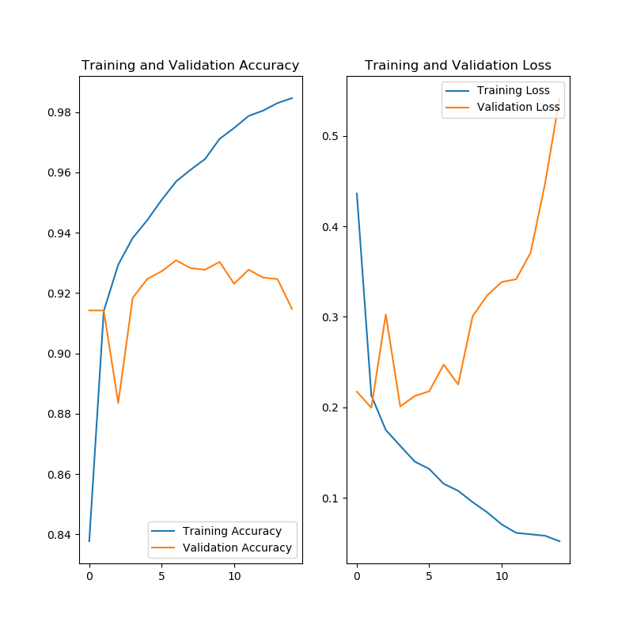

# Transferencia de aprendizaje

Existen modelo de redes ya entrenadas que podemos incluir en nuestros modelos. Hay una red CNN profunda famosa ```VGG16``` que ha clasificado 1000 clases con miles de imágenes. Podemos aprovechar todos los filtros que ha aprendido y ponerlo en nuestro modelo. Al final pondremos nuestra capa densa para la clasificación de perros/gatos

Cambios en el modelo:
- Introducida la primera parte de VGG16 con los pesos de imagenet
- Quitada la parte del data augmentation de la sección anterior (Nos quedamos con 25000 no aumentamos a 100000)
    - Aunque no hay que entrenar la red, hay que pasar la imágenes por la parte de VGG que también tarda.

Al no ser necesaria entrenar la parte convolucional es ridículo estar calculando el resultado de los filtros en cada EPOCH con lo que primero haremos una pasada por el conjunto de datos, calculamos sus mapas de activación y los guardaremos en varios ficheros.

NOTAS:
- Para entrenar esta red con la misma capa densa que la anterior y data augmentation cada epoch tardaba 3 horas!


## "Cacheo" de las capas de activación ya calculadas

Cargamos el modelo VGG16
```python
from tensorflow.keras.applications import VGG16
vgg16 = VGG16(
            weights='imagenet', # filtros de imagenet
            include_top=False, # sin capa densa
            input_shape=(IMAGE_RES, IMAGE_RES,3)
        )
```

¿Qué forma tiene?
 ```python
vgg16.layers[-1].ouput
>>> <tf.Tensor 'block5_pool/MaxPool:0' shape=(?, 7, 7, 512) dtype=float32>
```

Vemos como la información del Tensor se corresponde con la de la arquitectura de VGG16. 7x7 x 515 capas, el primer ? es el conjunto de datos introducidos


VGG16 -> 26 Mayo 2015
https://arxiv.org/abs/1505.06798


¿Cuánto ocupa en memoria tener esto cacheado? Por cada imagen tendremos un mapa de activación 

```python
7 x 7 x 515 = 25088 bits
25088 bits * (23076 train + 1924 valid) = 627200000 bits
627200000 bits / 8 = 78400000 Bytes
78400000 Bytes /1024 = 76562,5 KB 
76562,5 KB -> 76563 
76563 KB / 1024 = 74MB
```

Con el modelo de vgg cargado podemos llamar a predict con los batch e ir guardando los mapas de activación

```python
output_batch = vgg16.predict(input_batch)
``` 

Luego guardamos los mapas de activación con las funciones de numpy

```python
save('train_activations.npy', train_activations)
save('train_labels.npy', train_labels)
save('validation_activations.npy', validation_activations)
save('validation_labels.npy', validation_labels)
```

Este proceso ha tardado 45 minutos


## Entrenando nuestra red

Lo primero que haremos es cargar los mapas calculados

```python
train_activations = load('train_activations.npy')
train_labels = load('train_labels.npy')
validation_activations = load('validation_activations.npy')
validation_labels = load('validation_labels.npy')
```

Modelo... y resultados.


```python

model.add(Flatten(input_shape=(activation_w, activation_h, last_layer_filter)))
model.add(Dense(400, activation='relu'))
model.add(Dropout(0.2))
model.add(Dense(20, activation='relu'))
model.add(Dense(1, activation='sigmoid'))

model.compile(loss='binary_crossentropy',
              optimizer='rmsprop',
              metrics=['accuracy'])

model.summary()


Layer (type)                 Output Shape              Param #   
=================================================================
flatten (Flatten)            (None, 25088)             0         
_________________________________________________________________
dense (Dense)                (None, 400)               10035600  
_________________________________________________________________
dropout (Dropout)            (None, 400)               0         
_________________________________________________________________
dense_1 (Dense)              (None, 20)                8020      
_________________________________________________________________
dense_2 (Dense)              (None, 1)                 21        
=================================================================
Total params: 10,043,641
Trainable params: 10,043,641
Non-trainable params: 0

``` 




## Sin cache

Poniendo en nuestra red densa el modelo acoplado y sin entrenar pesos quedaría así:
```python
Model: "sequential"
_________________________________________________________________
Layer (type)                 Output Shape              Param #   
=================================================================
vgg16 (Model)                (None, 7, 7, 512)         14714688  
_________________________________________________________________
flatten (Flatten)            (None, 25088)             0         
_________________________________________________________________
dense (Dense)                (None, 400)               10035600  
_________________________________________________________________
dense_1 (Dense)              (None, 100)               40100     
_________________________________________________________________
dense_2 (Dense)              (None, 1)                 101       
=================================================================
Total params: 24,790,489
Trainable params: 10,075,801
Non-trainable params: 14,714,688
_________________________________________________________________
```

El problema es que esta ejecución tardaba 3 horas con 100000 muestras y 1 hora con 25000 muestras por EPOCH. Por cada batch (Pasar por filtro, pasar por densa, recalcular)