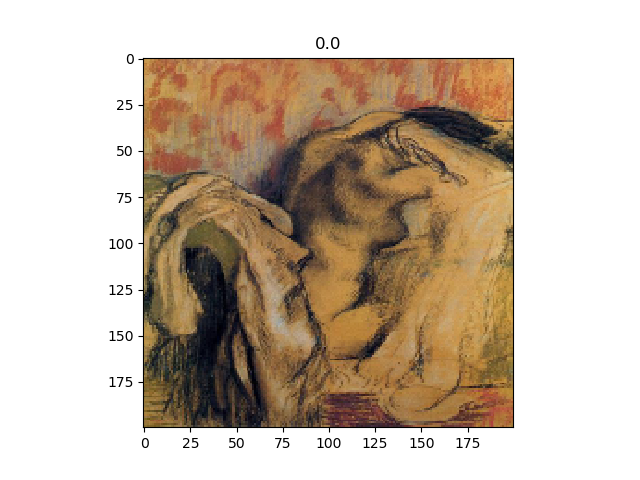
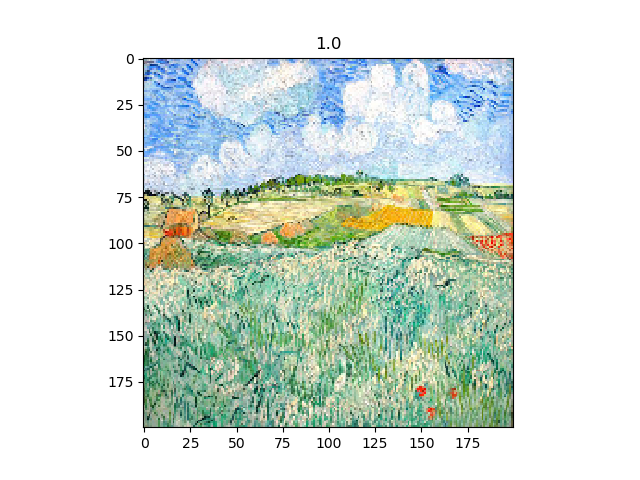
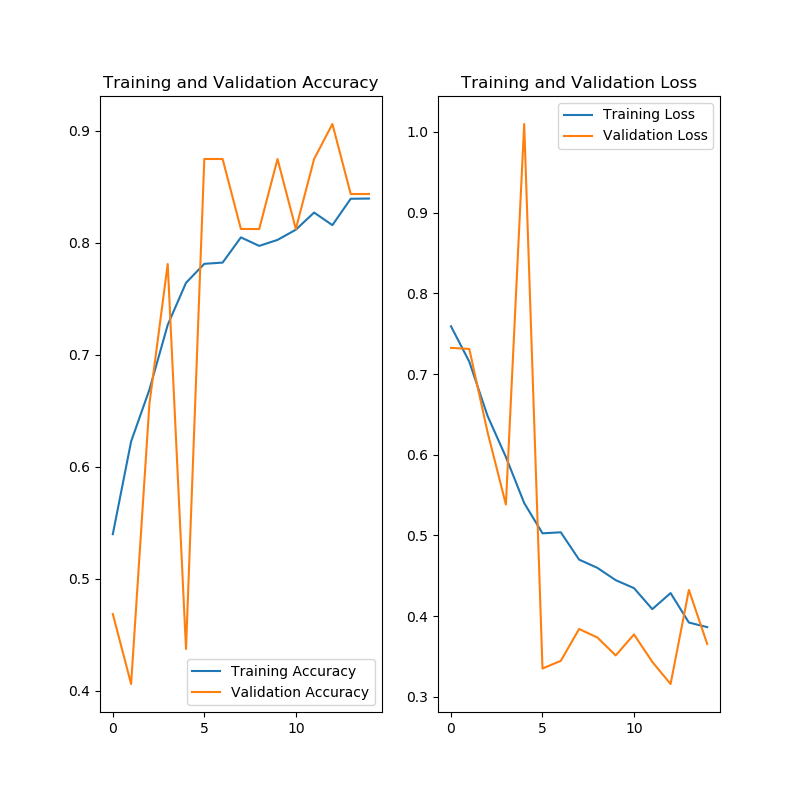

# Clasificación de cuadros

## Preparamos los datos

Copiamos las fotos a su directorio y sacamos un listado de los que tienen más cuadros. El script es:```prepare_data_folder.sh```

Sacamos el listado de cuadros en los directorios y los ordenamos
```bash
>du -a | cut -d/ -f2 | sort | uniq -c | sort -nr
    878 Vincent_van_Gogh
    703 Edgar_Degas
    440 Pablo_Picasso
    337 Pierre-Auguste_Renoir
```
NOTA: Por el comando aparece 1 imagen más de las que hay, se cuenta la entrada de directorio vacío. 

Quitamos el exceso de imágenes en Vicent para que estén balanceados: 702 

Separamos 54 imágenes para validación con el script ```split_train.sh```

```python
ntrain=648
nvalid=54
```

Algunas imágenes
Edgar: Clase 0


Vicent: Clase 1


## Redconvolucional y data augmentation

Con data augmentation para conseguir 2000 muestras y con la siguiente red
```python
# Modelo
model = Sequential()
# padding -> valid -> sin padding
# 32 filtros
model.add(Conv2D(32, (3, 3), input_shape=(IMAGE_RES, IMAGE_RES, 3), padding="valid", activation="relu"))
model.add(Conv2D(32, (3, 3), padding="valid", activation="relu"))
model.add(Conv2D(32, (3, 3), padding="valid", activation="relu"))
model.add(MaxPooling2D(pool_size=(2, 2)))
model.add(Conv2D(64, (3, 3), padding="valid", activation="relu"))
model.add(Conv2D(64, (3, 3), padding="valid", activation="relu"))
model.add(Conv2D(64, (3, 3), padding="valid", activation="relu"))
model.add(MaxPooling2D(pool_size=(2, 2)))
model.add(Conv2D(128, (3, 3), padding="valid", activation="relu"))
model.add(Conv2D(128, (3, 3), padding="valid", activation="relu"))
model.add(Conv2D(128, (3, 3), padding="valid", activation="relu"))
model.add(MaxPooling2D(pool_size=(2, 2)))
model.add(Flatten())
model.add(Dense(100, activation="relu"))
model.add(Dropout(0.1))
model.add(Dense(20, activation="relu"))
model.add(Dropout(0.1))
model.add(Dense(1, activation='sigmoid'))

model.summary()

Layer (type)                 Output Shape              Param #   
=================================================================
conv2d (Conv2D)              (None, 198, 198, 32)      896       
_________________________________________________________________
conv2d_1 (Conv2D)            (None, 196, 196, 32)      9248      
_________________________________________________________________
conv2d_2 (Conv2D)            (None, 194, 194, 32)      9248      
_________________________________________________________________
max_pooling2d (MaxPooling2D) (None, 97, 97, 32)        0         
_________________________________________________________________
conv2d_3 (Conv2D)            (None, 95, 95, 64)        18496     
_________________________________________________________________
conv2d_4 (Conv2D)            (None, 93, 93, 64)        36928     
_________________________________________________________________
conv2d_5 (Conv2D)            (None, 91, 91, 64)        36928     
_________________________________________________________________
max_pooling2d_1 (MaxPooling2 (None, 45, 45, 64)        0         
_________________________________________________________________
conv2d_6 (Conv2D)            (None, 43, 43, 128)       73856     
_________________________________________________________________
conv2d_7 (Conv2D)            (None, 41, 41, 128)       147584    
_________________________________________________________________
conv2d_8 (Conv2D)            (None, 39, 39, 128)       147584    
_________________________________________________________________
max_pooling2d_2 (MaxPooling2 (None, 19, 19, 128)       0         
_________________________________________________________________
flatten (Flatten)            (None, 46208)             0         
_________________________________________________________________
dense (Dense)                (None, 100)               4620900   
_________________________________________________________________
dropout (Dropout)            (None, 100)               0         
_________________________________________________________________
dense_1 (Dense)              (None, 20)                2020      
_________________________________________________________________
dropout_1 (Dropout)          (None, 20)                0         
_________________________________________________________________
dense_2 (Dense)              (None, 1)                 21        
=================================================================
Total params: 5,103,709
Trainable params: 5,103,709
Non-trainable params: 0

```

Conseguimos cerca del 80% - 90%


