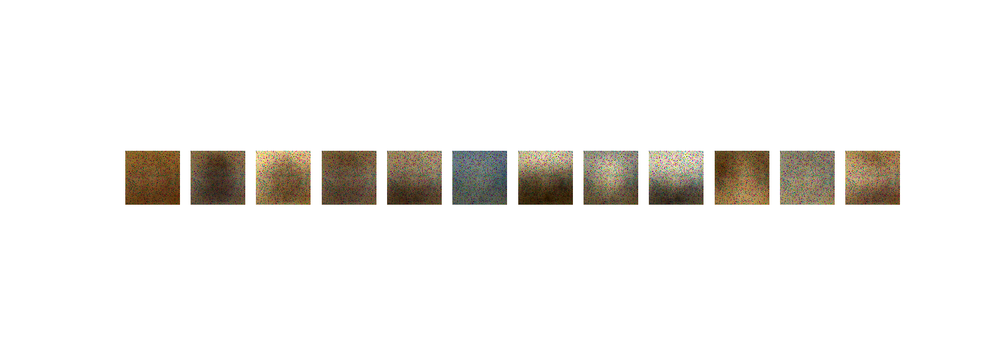
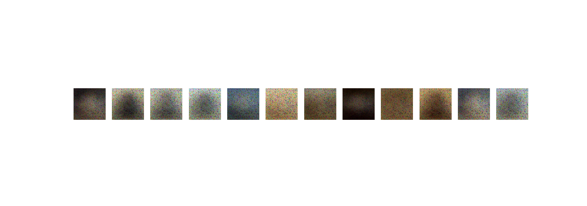
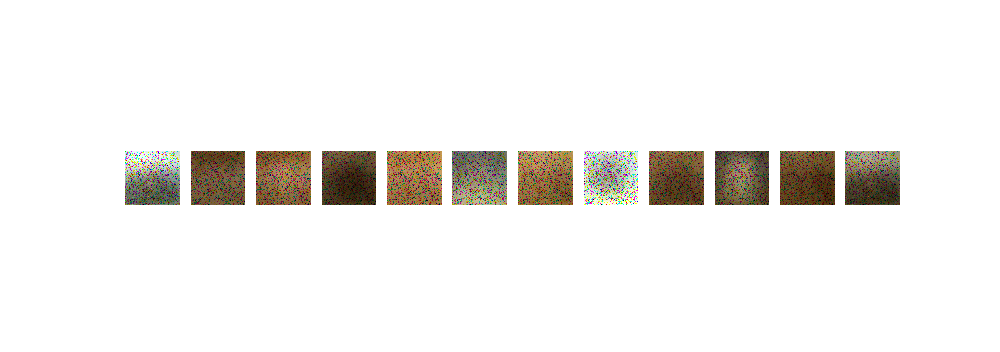
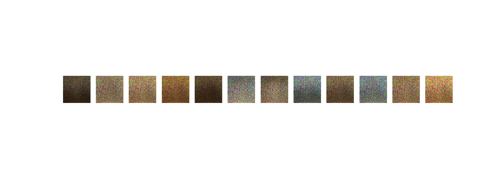
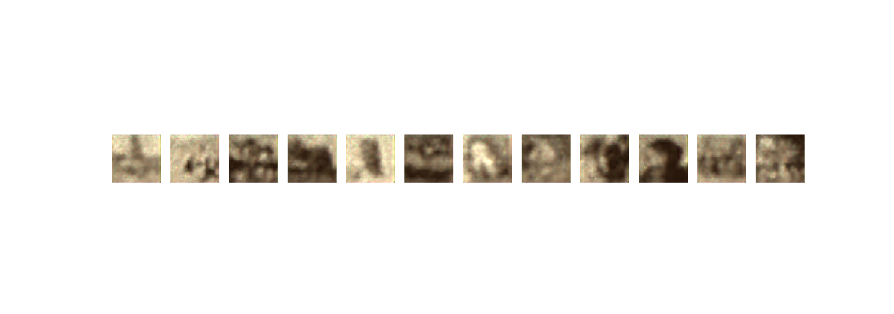

# Resultados autoencoder

## Datos

He reaprovechado los datos con los cuadros, solo con dos artistas. Haré más pruebas.

Para poder usar los datagenerator es fundamental utilizar el tipo de datos ```input```
```python
train_generator = train_datagen.flow_from_directory(
        DIR_TRAIN,
        target_size=(IMAGE_RES, IMAGE_RES),
        batch_size=BATCH,
        class_mode='input'
)
```

El código completo está en el fichero ['autoencoder_funcionando.py'](../autoencoder_funcionando.py)

## Red densa 1 capa

Son curiosos pero no muy similares. De hecho creía que tenía algo mal







## Red densa 3 capa

En estos se aprecia cierta profundidad pero nada claro.


## Convolucionales

Tras ver este he visto que la cosa mejora mucho y en los siguientes test saco el cuadro original


Comparados el cuadro original.


## Más trabjo

¿Qué pasa con los colores?
Mañana probaré con los cuadros de todos los artistas en vez de solo dos.

## Conclusiones

Parece que los autoencoders no están diseñados para reproducir al 100% la imagen original si no para comprimir la información. Por eso es imposible que aparezcan nítidas.

Para eso existen las GAN 